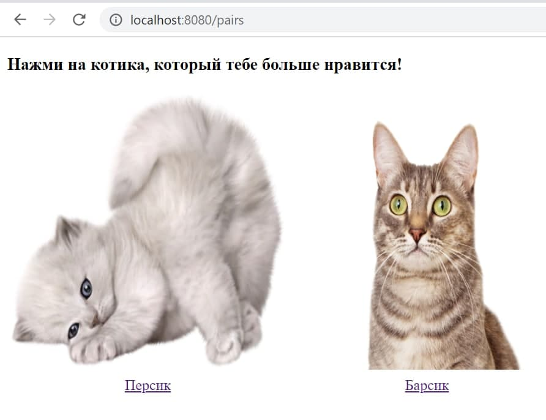
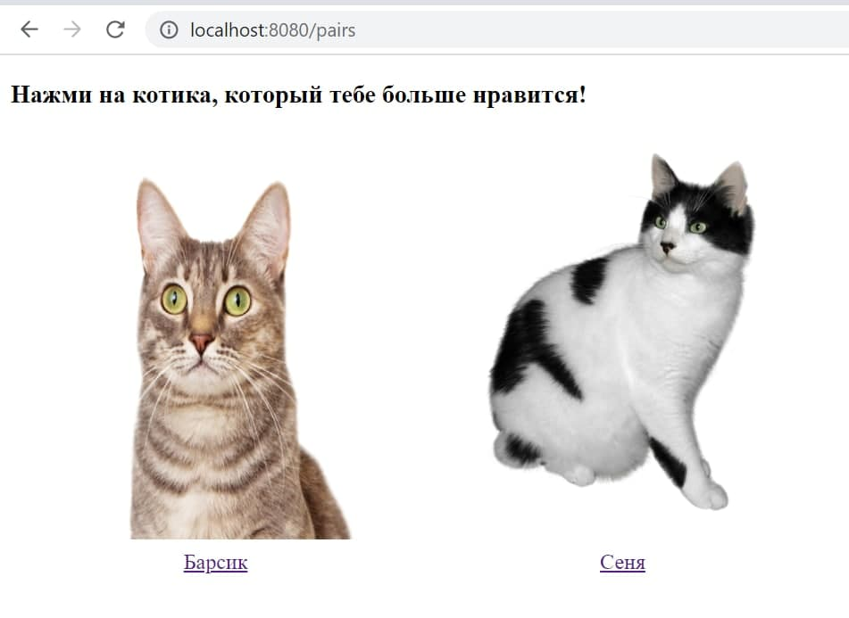
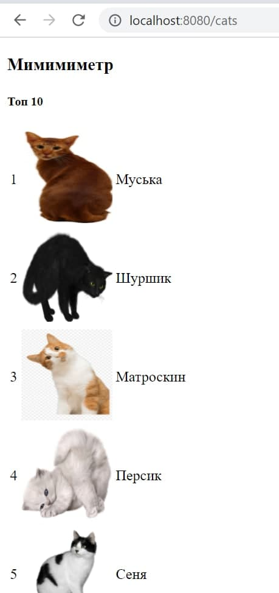
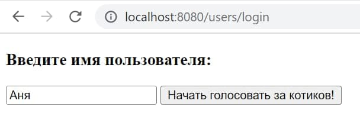

# Мимимиметр

Приложение, в котором вы можете проголосовать за одного 
из двух предложенных котиков, кликнув по его фотографии
или по его кличке:

После первого выбора вам будет показана 
следующая пара котиков:

И так, пока не закончатся все пары. 
Пары подбираются случайно, повторений пар нет.

Когда пары заканчиваются, пользователю показывается топ котиков, 
собранный из голосов всех пользователей:

При входе в приложение необходимо зарегистрироваться 
(вписать в предложенное окошко свой логин):

В программе предустановлены 6 котиков.
Для каждого пользователя формируется случайный порядок, 
в котором ему будут показаны пары котиков.

### Стек технологий:
Java 11, Maven, Spring Boot, Spring MVC, MapStruct, Swagger,
PostgreSQL, Liquibase, Lombok, Thymeleaf.